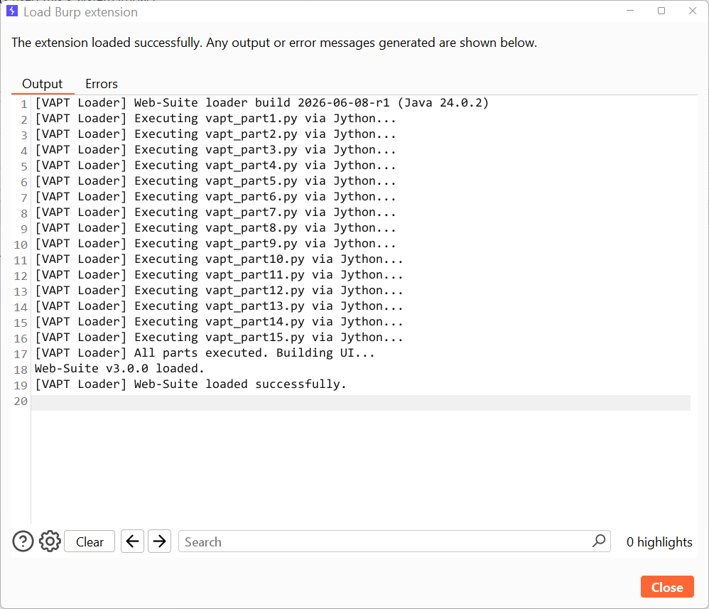
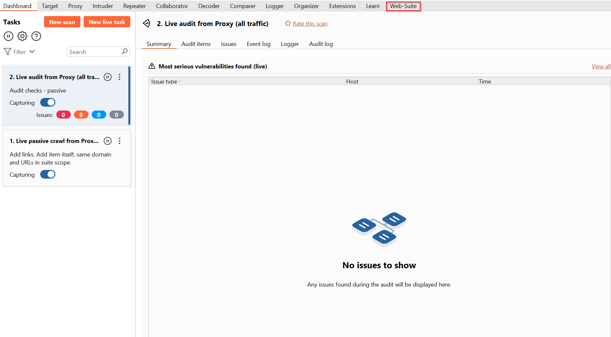
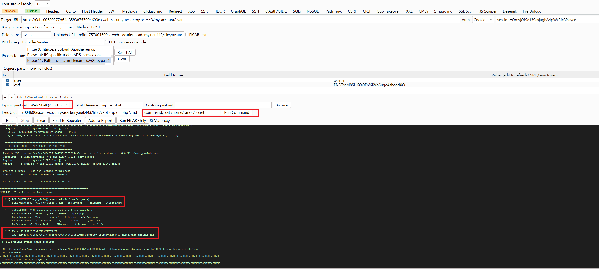

# Burp-Web-Suite

> **A 32-Module Web VAPT Extension for Burp Suite Professional**

The Burp Suite Professional counterpart to [Web-Suite](../Web-Suite) — the same
web-application testing toolkit, delivered as a single loadable Burp extension.
It adds a **Web-Suite** tab to Burp with 32 purpose-built modules covering the
OWASP-style web attack surface: injection, auth/token abuse, SSRF/IDOR, request
smuggling, deserialization, misconfig checks and more — each driving requests
through Burp's own HTTP stack and feeding a consolidated findings view.

Packaged as a **`.bapp`** (a Jython extension bundled with its runtime), so it
loads on any Burp Suite **2020+** (Community, Pro or Enterprise) with **no
Python install and no internet** required.

---

## ⚠️ Legal Disclaimer

For **authorised web application penetration testing only.** This extension
sends active attack payloads (injection, SSRF, smuggling, file upload, etc.)
through Burp to the target. Only point it at applications you have **explicit
written permission** to test. The author accepts no liability for misuse.

---

## Loading the extension

You can load the prebuilt binary directly — no build step needed:

1. Burp → **Extensions** → **Installed** → **Add**
2. **Extension type: Java**
3. Select **`web-suite.bapp`** (or `web-suite.jar` — they are identical)
4. A new **Web-Suite** tab appears in Burp.

The loader bootstraps the bundled Jython runtime, executes all module parts, and
reports **`Web-Suite v3.0.0 loaded successfully`**:



> `web-suite.bapp` and `web-suite.jar` are byte-for-byte the same file — a
> `.bapp` is simply the extension format Burp's BApp Store uses. Either loads
> the same way as a **Java** extension.



---

## How you use it

Most modules follow the same flow: **send a request to the module** (right-click
a request in Proxy/Repeater/Target → *Extensions → Web-Suite → send to …*, or
paste/select in the module panel), **run the check**, and review results in that
module and in the consolidated **Findings** tab. **All Scans** shows everything
in flight; **Findings** aggregates confirmed issues with severity and evidence
for reporting.

---

## In action

A few modules mid-engagement — from a quick check to a confirmed remote code
execution.

**File Upload → RCE.** The File Upload module walks 18 upload-bypass techniques;
here a path-traversal filename (`..%2f`) slips a PHP web shell past the filter,
and the built-in command runner confirms code execution — `cat /home/carlos/secret`
returns as `uid=12002(carlos)`. **RCE confirmed.**



**SQL Injection with a built-in engine.** No external `sqlmap` binary — the SQLi
module runs a self-contained, WAF-aware engine that first balances the query,
confirms boolean- and error-based injection, fingerprints the DBMS (MySQL 5.6.51),
and enumerates databases and tables inline.


**Security-header audit.** One pass flags every missing or misconfigured security
header — CSP, HSTS, X-Frame-Options, Referrer-Policy, COOP/COEP/CORP,
Permissions-Policy — plus information-disclosure headers, with the concrete risk
spelled out per finding.


**JavaScript recon.** The JS Scraper crawls the app, mines every JavaScript file
and inline script (120 pages, 68 JS files, 445 inline scripts here) and surfaces
leaked secrets and attack surface — a hardcoded Google/GCP API key, subdomains,
IP addresses and email addresses.


---

## Modules

All 32 tabs, grouped by what they test. Each links to its screenshot.

### Config, headers & client-side
| Tab | What it checks | |
|-----|----------------|---|
| **Headers** | Missing/weak security headers (CSP, HSTS, X-Frame-Options…) | [img](screenshots/headers.png) |
| **CORS** | Cross-origin resource-sharing misconfigurations | [img](screenshots/cors.png) |
| **Host Header** | Host-header injection / password-reset poisoning | [img](screenshots/host-header.png) |
| **Methods** | HTTP verb tampering & method-based access bypass | [img](screenshots/methods.png) |
| **Clickjacking** | Framing protections + PoC generation | [img](screenshots/clickjacking.png) |
| **Redirect** | Open-redirect discovery | [img](screenshots/redirect.png) |
| **Sessions** | Session/cookie flags, fixation, predictability | [img](screenshots/sessions.png) |

### Injection
| Tab | What it checks | |
|-----|----------------|---|
| **XSS** | Reflected & DOM cross-site scripting | [img](screenshots/xss.png) |
| **SQLi** | SQL injection | [img](screenshots/sqli.png) |
| **NoSQLi** | NoSQL injection | [img](screenshots/nosqli.png) |
| **SSTI** | Server-side template injection | [img](screenshots/ssti.png) |
| **CMDi** | OS command injection | [img](screenshots/cmdi.png) |
| **CRLF** | CRLF / header injection | [img](screenshots/crlf.png) |
| **Path Trav.** | Directory traversal / LFI | [img](screenshots/path-traversal.png) |
| **XXE** | XML external entity injection | [img](screenshots/xxe.png) |

### Server-side & logic
| Tab | What it checks | |
|-----|----------------|---|
| **SSRF** | Server-side request forgery (with OOB callback) | [img](screenshots/ssrf.png) |
| **IDOR** | Insecure direct object references | [img](screenshots/idor.png) |
| **CSRF** | Anti-CSRF token analysis + PoC | [img](screenshots/csrf.png) |
| **Smuggling** | HTTP request smuggling (CL.TE / TE.CL) | [img](screenshots/smuggling.png) |
| **Deserial.** | Insecure deserialization | [img](screenshots/deserialization.png) |
| **File Upload** | Unrestricted / malicious file upload | [img](screenshots/file-upload.png) |
| **403 Bypass** | Access-control / forbidden-path bypass | [img](screenshots/403-bypass.png) |

### Auth & tokens
| Tab | What it checks | |
|-----|----------------|---|
| **JWT** | Full JWT workshop: decode, risk flags, JWKS probe, and forge (alg=none, RS→HS confusion, KID/JKU injection, embedded JWK, claim tamper, HS brute-force, modulus recovery) | [img](screenshots/jwt.png) |
| **OAuth/OIDC** | OAuth / OpenID Connect flow analysis | [img](screenshots/oauth-oidc.png) |

### API, recon & misc
| Tab | What it checks | |
|-----|----------------|---|
| **GraphQL** | Introspection & query abuse | [img](screenshots/graphql.png) |
| **API/Postman** | Postman/OpenAPI collection import & testing | [img](screenshots/api-postman.png) |
| **JS Scraper** | Endpoint & secret mining from JavaScript | [img](screenshots/js-scraper.png) |
| **SSL Scan** | TLS/certificate configuration analysis | [img](screenshots/ssl-scan.png) |
| **Sub Takeover** | Subdomain-takeover (dangling DNS) detection | [img](screenshots/sub-takeover.png) |
| **EICAR / AV** | Anti-malware / upload-filter testing | [img](screenshots/eicar-av.png) |

> **Headers**, **SQLi**, **File Upload** and **JS Scraper** (plus the loading
> and overview shots) have real captures — see the [In action](#in-action)
> section. The remaining module screenshots are placeholders; see
> [`screenshots/README.md`](screenshots/README.md) for the filename each maps to,
> and drop a real PNG in with the matching name to have it render automatically.

---

## Building it yourself (optional)

The prebuilt `web-suite.bapp` is ready to load, but you can rebuild from source:

```bash
# Linux/macOS
./build.sh
# Windows
build.bat            # or build_bapp.bat for the .bapp packaging
```

The build bundles [`vapt_burp_extension.py`](vapt_burp_extension.py) (the
extension, ~22k lines) with a Jython standalone runtime, using
[`BurpExtensionLoader.java`](BurpExtensionLoader.java) as the Java shim so Burp
loads it as a Java-type extension. Payload lists live in
[`wordlists/`](wordlists) (`sql`, `xss`, `lfi`, `nosql`, `crlf`).

---

## Files

| Path | Purpose |
|------|---------|
| `web-suite.bapp` / `web-suite.jar` | The loadable extension (identical files, 48 MB — bundled Jython) |
| `vapt_burp_extension.py` | Extension source (all 32 modules) |
| `BurpExtensionLoader.java` | Java shim so the Jython extension loads as a `.bapp` |
| `build.sh` / `build.bat` / `build_bapp.bat` | Build scripts |
| `requirements.txt` | Build-time Python dependencies |
| `wordlists/` | Injection payload lists |
| `screenshots/` | Module screenshots (see its README) |

---

## Credits & Inspiration

This is an original tool, written from scratch for my own web-VAPT and bug-bounty
workflow. It stands on the shoulders of the tools and resources that taught me
these techniques — none of their source code is used here; the implementations
are my own, informed by their **published, well-documented approaches**:

- **[sqlmap](https://github.com/sqlmapproject/sqlmap)** — the SQLi module is a
  self-contained reimplementation of the *detection and enumeration approach*
  (boolean/error-based confirmation, DBMS fingerprinting, injection boundaries).
  No sqlmap source code is copied or bundled. The module can *optionally* invoke
  an external `sqlmap` binary if you have one installed on your PATH — it is not
  redistributed with this project.
- **[PayloadsAllTheThings](https://github.com/swisskyrepo/PayloadsAllTheThings)**,
  **[SecLists](https://github.com/danielmiessler/SecLists)** and the
  **[OWASP Testing Guide](https://owasp.org/www-project-web-security-testing-guide/)**
  — references for payloads and test methodology.
- **[PortSwigger Web Security Academy](https://portswigger.net/web-security)** —
  learning material behind many of the checks (the File Upload demo above is a
  PortSwigger Academy lab).

**Bundled third-party runtime** (redistributed under their own licenses):
[Jython](https://www.jython.org/), and via Jython, BouncyCastle and ICU. These
remain under their respective upstream licenses.

## License

Original code in this project is released under the **[MIT License](LICENSE)**.
Bundled runtimes/libraries remain under their own licenses (see above).

---

<div align="center">
  <sub>Built by a pentester, for pentesters · Singapore 🇸🇬</sub>
</div>
